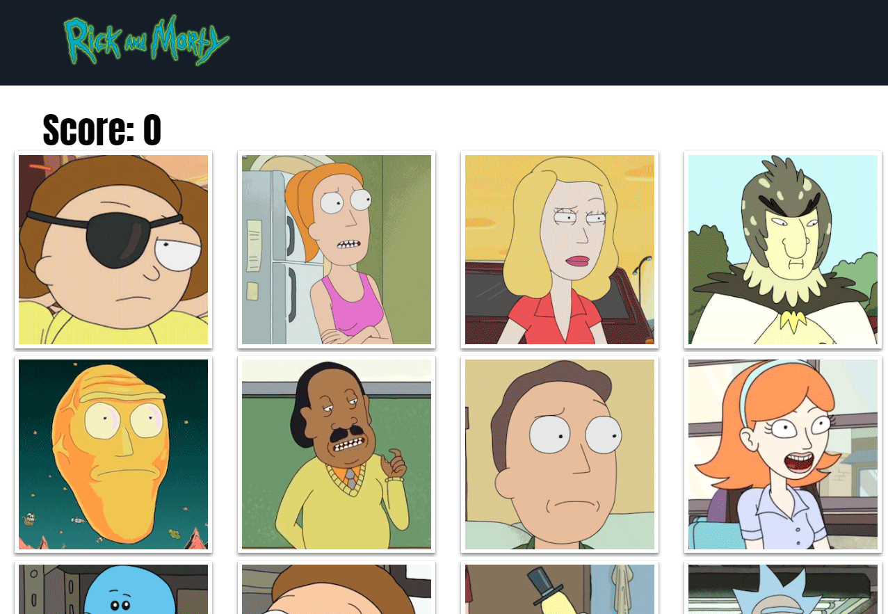

# Memory Game Application
This application allows the user play a quick memory game. The object of the game is to ensure you do not click on the same tile twice. This game was created using React, utilizing a change in state to keep score, swap tiles, and generate images. 

#### This web application was created with the following technologies:
* React
* JSON

View the live app at: https://quiet-gorge-19766.herokuapp.com/

